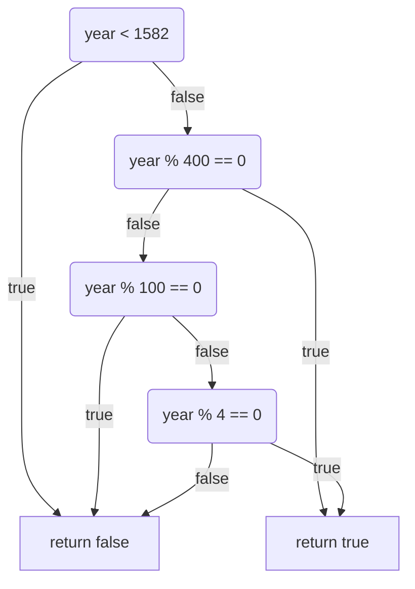

# Leap Year CLI

## IsLeapYear diagram

## IsLeapYear function

The function IsLeapYear receives an input as an integer. We call this input parameter "year".
First, we check if the input year is before or after leap years introduction in 1582 and if it
isn’t, we will return false.

Next, we will check if the input is divisible by 400, in which case we return true.

Is it not, we will check if it is divisible by 100. If it is, we will return false.

If it is not, we will check if it is divisible bt 4. If it is, we will return true.

Finally, if none of the conditions were met, we return false.
